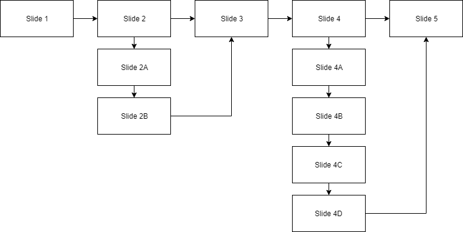

## About
Last Updated *[10/28/2019]*   
Created by [OSU Maps and Spatial Data](https://info.library.okstate.edu/map-room)


## Table of Contents
- Introduction 
- - Basic Setup
- - Folder Structure
- - Creating Presentation Content
- - Adding Style
- Conclusion
- Further Reading/Resources

## Introduction
reveal.js is a wonderful way to create sleek and unique presentations using HTML.
There are many features available to add flare to your presentation and *wow* your audience.
In this guide, I will walk you through the basic steps needed to create your own presentation.

#### Basic Setup
The **basic setup** allows you to author your very own presentations only. There is a **full setup**, but we'll go over this in another guide. 
1. To get started, you need to download the lastest version of reveal.js from [this website](https://github.com/hakimel/reveal.js/releases).
2. Unzip and replace the contents in index.html with your own presentation content.
3. Use a browser to open and view your presentation.

#### Folder Structure
There are a few different folders to store separate elements
- **css/** Core stules that make the project function correctly
- **js/** Similar to CSS but for JavaScript
- **plugin/** Stores components that were developed as extensions to reveal.js
- **lib/** Any other third party asset (JavaScript, CSS, etc.)

#### Creating Presentation Content
I, personally, prefer to create my presentation content before I get too mixed up in the style and appearance of the presentation. However, this is not the only way to create a *reveal.js* presentation. 

1. First, we need to begin with our presentation's skeleton. 
```<html>
	<head>
		<link rel="stylesheet" href="css/reveal.css">
		<link rel="stylesheet" href="css/theme/white.css">
	</head>
	<body>
		<div class="reveal">
			<div class="slides">
				<section>Slide 1</section>
				<section>Slide 2</section>
			</div>
		</div>
		<script src="js/reveal.js"></script>
		<script>
			Reveal.initialize();
		</script>
	</body>
</html>
```
The order of the presentation markup must be *.reveal > .slides > section*. Each *section* represents a different slide. 
2. Let's create a title page. For my presentation, I will be talking about hedgehogs, so this is the code for my very first slide. 
```
<section>
	<h1>Hedgehogs:</h1>
	<h2>The World's Cutest Animal</h2>
	<p>By: Addison Van Zandbergen</p>	
</section>
```
3. Continue to add sections as desired.

#### Adding Style
- Verticle Slides
Creating verticle slides is an easy way to spice up your presentation and allows you to sort your presentations into different sections.
1. To create verticle slides, you will simply add sections within a section. These nested sections will serve as verticle slides.
```
<section>
	<section>
		<h1>Famous Hedgehogs</h1>
	</section>
	<section>
		<p>Count Hogula</p>
		
	</section>
	<section>
		<p>The God Hogger</p>
		
	</section>
	<section>
		<p>El Hogo</p>
		
	</section>
	<section>
		<p>Hoggalo Bill</p>
		
	</section>
	<section>
		<p>Hogiel</p>
		
	</section>
	<section>
		<p>Santa Hog</p>
		
	</section>
	<section>
		<p>Hoggy Flay</p>
		
	</section>
</section>
```
2. The flow of nested/verticle sections will be different based on the navigation techniques you use. We will go over these in the next section. 
- Navigation

There are different ways to navigate through your presentation. I will touch on a few of these here.



**Spacebar**
The simplest way to navigate through your presentation is to simply hit the *spacebar* every time you wish to change slides. This includes verticle slides as well. Take a look at the diagram above. By using *spacebar*, your presentatio will go directly from *Slide 2* to *Slide 2A* and, later, from *Slide 2B* to *Slide 3*.

**Arrow Keys**
Using the *arrow keys* is also a simple way to navigate through your slides, but be careful when including verticle slides. To navigate from one slide to the next, simply use *→*. If you have verticle slides though, you must use *↓* to navigate through them. If you use *→*, the verticle slides will be skipped. As seen in the diagram, using *→* will jump from *Slide 2* to *Slide 3*, but *↓* will jump from *Slide 2* to *Slide 2A*. You must also use *→* to jump from *Slide 2B* to *Slide 3*. If by mistake you skip a slide, you can use *←* to navigate through regular slides or *↑* to navigate backwards through verticle slides. 

*Note: There are ways to override this, but we will go over that in a more advanced reveal.js guide. (See link at the bottom of the page.)*

**Auto-sliding**
You can configure auto-sliding to avoid manual navigation altogether. There are two different ways to achieve this. If you want automatic navigation through the whole presentation, you can add this code to your configuration settings.
```
<script>
	// Slide every 3 seconds
	Reveal.configure({
  		autoSlide: 3000
	});	
</script>
```
If you would rather only auto-slide through a portion of your presentation, you can enter a simple line of code to that section.
```
// Slide every 3 seconds through this section only
<section data-autoslide="3000"; >
	<section>
		<h1>Famous Hedgehogs</h1>
	</section>
</section>
```
- Transitions
Transitions are a great way to add flare to your presentation and they are simple to add! You can choose from ```concave``` ```convex``` ```fade``` ```slide``` ```zoom``` and ```none```. To add a transition, just add a little bit of code to each section, like we did with auto-slide. 
```
<section data transition="fade">
	<h1>Adaptation</h1>
	<p class="fragment fade-in">To protect themselves from predators, hedgehogs have sharp spines and...</p>
</section>
```
- pictures
- themes

## Conclusion

## Further Reading/Resources


[Return to Top](#about)
